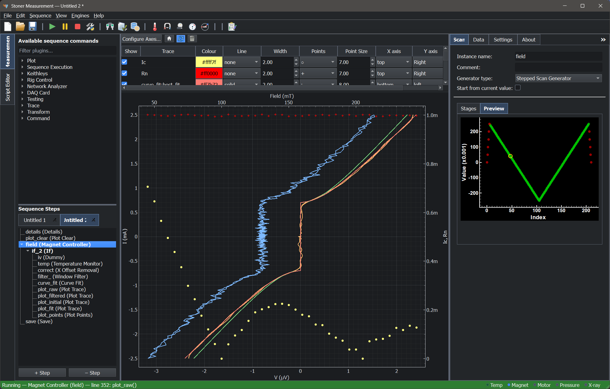

# Stoner Measurement

[](https://gb119.github.io/stoner_measurement/)
[](https://pypi.org/project/stoner_measurement/)
[![Run Tests][tests-badge]][tests-workflow]
[![Codacy Badge][codacy-badge]][codacy-dashboard]

[tests-badge]: https://github.com/gb119/stoner_measurement/actions/workflows/tests.yml/badge.svg
[tests-workflow]: https://github.com/gb119/stoner_measurement/actions/workflows/tests.yml
[codacy-badge]: https://app.codacy.com/project/badge/Grade/f20d5771398343cd87a26c21ca6b7c7e
[codacy-dashboard]: https://app.codacy.com/gh/gb119/stoner_measurement/dashboard?utm_source=gh&utm_medium=referral&utm_campaign=Badge_grade

Stoner Measurement is a desktop application for building, running, and saving
automated laboratory measurements.

Build transport and cryogenic experiments graphically, combine point-by-point
scans with continuous sweeps, and inspect readings and processed traces live —
with editable Python available for custom control.

It is designed for experimental scientists who want to combine common
measurement actions — such as setting fields, changing temperature, waiting for
stability, collecting readings, monitoring values, and plotting data live —
without needing to write code for every measurement.



You create a measurement sequence from a set of sequence plugins. Plugins support,
amongst other things:

- electrical transport measurements
- point-by-point scans of magnetic field, temperature, rotational angle, and gate voltage,
  with measurements taken after each set-point is reached
- continuous sweeps of magnetic field, temperature, and angle, with data acquisition
  running alongside the sweep
- flow control primitives — loop breaks, conditional statements, and more
- filtering, fitting, and FFT analysis
- sending data to be plotted — either complete traces of (x, y) points or individual
  (x, y) data points
- saving data to tab-delimited text files or NeXus HDF5 files

Saved data files retain the measurement sequence and its configuration, so you
can reconstruct the entire sequence in the graphical editor to inspect, modify,
and rerun it. Keeping the procedure with the results supports repeatability and
experimental provenance.

Scans and sweeps are distinct sequence operations: choose whether to measure at
individual set-points or keep acquiring data while the experimental conditions
change continuously. Both can be combined with nested sequences and flow control.

After the sequence is defined, it is converted to a Python script and run on an embedded Python
kernel that provides runtime support for interacting with the GUI, managing state, and evaluating
arbitrary expressions using the script state as context.

During a run, the application can display live plots, show logged messages,
track live values, and open dedicated temperature-control and magnet-control
panels.

The Python kernel is also connected to an IPython console so you can interact with the measurement
and hardware directly in the console. Because the measurement sequence is converted to Python, if you
need more sophisticated and fine-grained control than the sequence gives you, you can edit a Python
script (or write one from scratch!) and then run it on the application's kernel and runtime.

## What you can do with it

Stoner Measurement is intended for experiments where you need to coordinate
several instruments in a repeatable way. Typical uses include:

- transport measurements as a function of temperature, field, or time
- automated sweeps and scans
- live monitoring of instrument state
- scripted or semi-scripted measurement procedures
- reusing saved measurement sequences for routine experiments

The application supports instrument drivers for common laboratory roles such as:

- source meters
- current sources
- nanovoltmeters
- lock-in amplifiers
- magnet controllers
- temperature controllers
- ADC/DAC cards

## Main parts of the application

The main window contains two top-level work areas.

### 1. Measurement

This is the main workspace for routine use. It contains three panels:

| Area             | Purpose                                             |
| ---------------- | --------------------------------------------------- |
| **Left panel**   | Plugin list, sequence tree, and monitoring controls |
| **Centre panel** | Live plotting area for measurement data             |
| **Right panel**  | Configuration for the currently selected step       |

A typical workflow is:

1. Choose a plugin from the available list.
2. Add it to the measurement sequence.
3. Select the step and edit its settings in the right-hand panel.
4. Repeat until the full procedure has been built.
5. Run the sequence and watch the data update live.

### 2. Script Editor

This tab provides a Python editor and an interactive console. It is useful when:

- you want to inspect or modify generated code
- you prefer to run measurements as Python scripts
- you need custom logic beyond the standard graphical workflow

## Main windows and tools

In addition to the main measurement editor, the application provides several
supporting tools:

- **Log Viewer** — shows messages generated while the application and sequence
  are running
- **Value Watch** — shows live values exposed by the running sequence
- **Temperature Control** — a dedicated non-modal panel for configuring and
  monitoring a temperature controller
- **Magnet Control** — a dedicated non-modal panel for configuring and
  monitoring a magnet controller
- **Preferences** — application settings such as theme and default paths

The main toolbar includes built-in actions for creating, opening, and saving
measurements or scripts, running and stopping a sequence, generating Python code
from the measurement tree, and opening the monitoring windows.

## Running a measurement

For a typical experiment:

1. Open the **Measurement** tab.
2. Add the required steps to the sequence.
3. Configure each step in the right-hand panel.
4. Save the sequence if you want to reuse it later.
5. Click **Run**.
6. Watch the live plot, log viewer, or value watch as the experiment proceeds.

Depending on your setup, you may also open the temperature or magnet control
panels from the toolbar or the Engines menu.

## Using the control engines from scripts

The package also exposes the shared controller engines for scripting and
interactive use. This is useful when you want to prototype automation logic
without building a full GUI measurement sequence.

For motor control, a simulated driver is available for testing:

```python
from stoner_measurement import MotorControllerEngine, SimulatedMotorController

driver = SimulatedMotorController()
engine = MotorControllerEngine()
engine.connect_instrument(driver)

engine.set_velocity(20.0)
engine.set_acceleration(60.0)
engine.move_to_angle(45.0)

state = engine.read_controller_state()
if state is not None and state.reading is not None:
    print("Angle:", state.reading.angle)
    print("Target:", state.reading.target_angle)
    print("Moving:", state.reading.moving)

engine.shutdown()
```

Equivalent top-level public imports are also available for the other shared
controller systems:

- `TemperatureControllerEngine`
- `MagnetControllerEngine`
- `MotorControllerEngine`

Alongside these, the corresponding engine state and reading types are exported
for use in scripts and notebooks.

## Saving your work

The application supports saving and loading both:

- **measurement sequences** built in the graphical editor
- **Python scripts** used in the Script Editor

The New, Open, Save, and Save As actions automatically apply to whichever main
tab is currently active.

You can also use **Import Sequence from Data…** to reconstruct a measurement
sequence from the metadata in a saved tab-delimited or NeXus HDF5 data file.
The restored sequence can be inspected and edited in the graphical editor,
allowing you to repeat or adapt an earlier experiment without rebuilding its
procedure manually.

## Installation

### Requirements

- Python 3.12 or newer
- A working Qt environment via one of the supported bindings
- Instrument-specific dependencies if you want to use hardware drivers beyond
  the basic application install

### Install from PyPI

```bash
pip install stoner_measurement
```

If you need a specific Qt binding, install one separately, for example:

```bash
pip install PyQt6
```

### Install from source

```bash
git clone https://github.com/gb119/stoner_measurement.git
cd stoner_measurement
pip install -e ".[dev,docs]"
```

## Launching the application

From the command line:

```bash
stoner-measurement
```

Or from Python:

```python
from stoner_measurement.main import main
main()
```

## Notes for system administrators and advanced users

### Configuration locations

The application stores user-specific configuration in the platform-specific user
configuration area.

Within this project, machine-specific configuration files are resolved relative
to:

```text
platformdirs.user_config_path("stoner_measurement").parent
```

This avoids creating an unnecessarily nested
`.../stoner_measurement/stoner_measurement` directory.

### Plugin configuration files

Plugin defaults are shipped as YAML files inside:

```text
src/stoner_measurement/conf/plugins/
```

Per-machine overrides are stored under:

```text
<platformdirs.user_config_path("stoner_measurement").parent>/plugins/
```

On Linux this is typically:

```text
~/.config/stoner_measurement/plugins/
```

These YAML files match the plugin settings used by the application, so they can
be edited outside the GUI when a local setup needs different defaults, such as
instrument addresses or site-specific options.

When a plugin is instantiated, bundled defaults are loaded first and then any
per-machine override is applied on top.

### Toolbar configuration

The application supports additional configurable toolbar buttons for loading
predefined measurement sequences.

The bundled example configuration is:

```text
src/stoner_measurement/conf/toolbar.yaml
```

A user-specific toolbar configuration can be stored as:

```text
<platformdirs.user_config_path("stoner_measurement").parent>/toolbar.yaml
```

Additional icons and predefined sequences are searched for in the corresponding
user configuration folders before falling back to bundled resources.

## Notes for developers

Stoner Measurement is structured around:

- a plugin-based sequence system
- instrument driver abstractions built from transport/protocol layers
- a Qt-based desktop interface
- a sequence engine that can execute generated Python code
- pytest-based tests and Sphinx documentation

Plugins are discovered from the
`stoner_measurement.plugins` entry-point group.

Full developer and API documentation is available at:

<https://gb119.github.io/stoner_measurement/>

## Licence

Distributed under the MIT Licence. See [LICENSE](LICENSE) for details.
